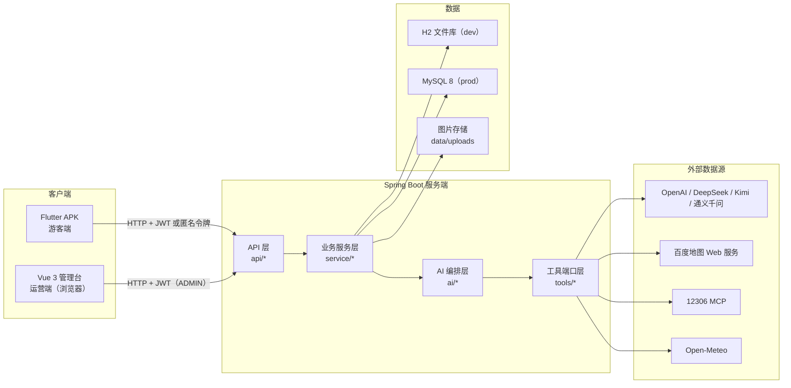
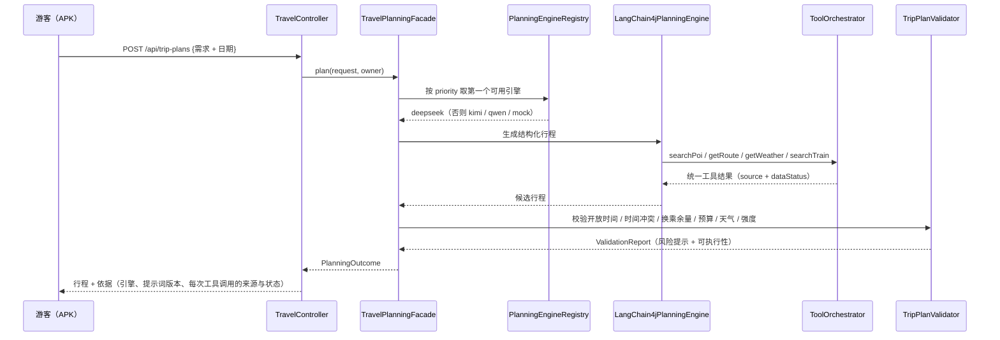
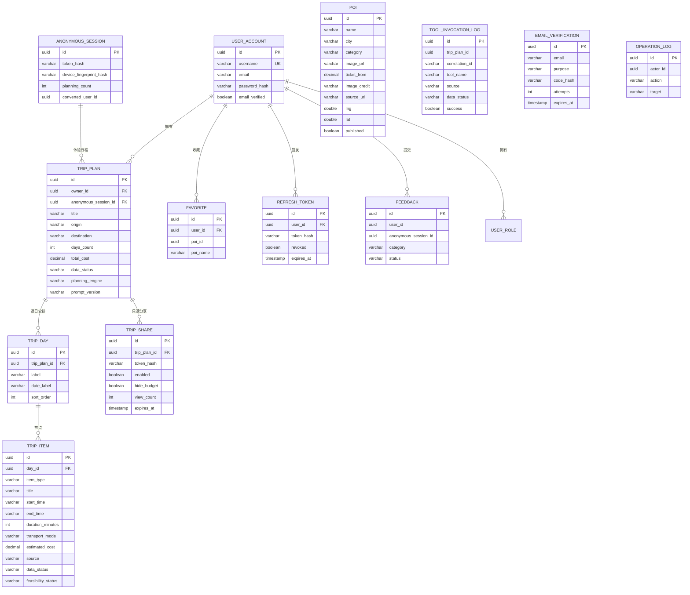

# 《豫见智旅》技术架构与数据模型

> 面向比赛"技术路线"评分项。本文只写**代码里真实存在**的东西：
> 每个模块、每个外部数据源、每张表都能在仓库里找到对应实现。
> 计划过但最终换掉的技术在第 6 节如实列出并给出替换理由。

## 1. 总体架构

系统由三条线组成：

| 线 | 形态 | 面向 | 代码位置 |
| --- | --- | --- | --- |
| 游客端 | Flutter Android APK | 游客 | `flutter_app/` |
| 服务端 | Spring Boot 3.3.5 / Java 17 | 全部 | `backend/server/` |
| 运营端 | Vue 3 + Vite 单页管理台 | 运营 / 管理员 | `backend/admin/` |

一条硬性边界：

> **APK 从不直连任何外部数据源。** 12306、百度地图、Open-Meteo、大模型全部由服务端编排，
> 第三方 AK / API Key 只存在于服务端环境变量，安装包里没有密钥。



## 2. 客户端：Flutter APK

### 2.1 导航结构

底部三个一级入口，避免移动端导航过载：

| Tab | 职责 |
| --- | --- |
| 发现 | 品牌首屏、一句话输入、快捷场景、三条示范走廊、景区大图卡片 |
| 行程 | 出行条件表单 → 生成 → 结果（行程 / 地图 / 预算 / 天气）→ 局部调整 → 历史行程 |
| 我的 | 登录注册、收藏、分享、反馈、关于与隐私 |

首页的自然语言输入与"规划"页共用同一份状态：首页写一句话点"开始规划"，会直接带着文本切到行程 Tab，
不是两个互不相干的输入框。

### 2.2 目录分层

| 目录 | 职责 |
| --- | --- |
| `lib/core/config/` | 构建期环境解析（`API_BASE_URL` 等），release 无明文回退 |
| `lib/core/network/` | Dio 工厂、会话拦截器、统一错误模型 `ApiFailure` |
| `lib/core/storage/` | 匿名/登录令牌走系统安全存储；内容走 JSON 文件缓存 |
| `lib/core/theme/` | 色彩、间距、字体 token（青黛 / 朱砂 / 麦穗金，圆角 18 / 14） |
| `lib/core/widgets/` | 跨页复用的表单控件、状态徽标、图片板、路线尺、城市弹层等 |
| `lib/data/repositories/` | 唯一的网络出入口，负责"远端 → 缓存 → 本地演示"三级降级 |
| `lib/models/` | 与后端 JSON 一一对应的模型 |
| `lib/screens/` | 页面与页面级状态 |

### 2.3 依赖（`flutter_app/pubspec.yaml`，全部 MIT / BSD）

| 依赖 | 版本 | 用途 |
| --- | --- | --- |
| flutter_riverpod | ^2.5.1 | 状态管理与依赖注入 |
| dio | ^5.7.0 | HTTP 客户端与拦截器 |
| flutter_secure_storage | ^9.2.2 | 令牌入系统 keystore |
| cached_network_image | ^3.4.1 | 景区图磁盘缓存，支撑弱网看图 |
| path_provider | ^2.1.5 | 缓存目录定位 |
| share_plus | ^10.1.2 | 系统分享 |

刻意**没有**引入的依赖见第 6 节（GoRouter、Drift、timeline_tile、FL Chart、百度地图 Flutter 插件、Geolocator）。

## 3. 服务端：Spring Boot

### 3.1 分层

| 包 | 职责 |
| --- | --- |
| `api/` | 控制器、请求/响应模型、全局异常处理；只做参数校验与编排 |
| `service/` | 账号、匿名会话、行程、分享、收藏、反馈、媒体、统计、地理编码 |
| `ai/` | 规划引擎注册表、四家 LLM 适配、提示词工厂、结果解析、行程校验器 |
| `tools/` | 外部数据源统一端口：天气 / 路线 / 车次 / 门票 / 开放时间 |
| `map/` | 静态底图代理、票据、投影与可信度判定 |
| `domain/` | 13 个 JPA 实体 |

### 3.2 AI 规划链路



三条设计原则：

1. **LLM 只负责"理解与生成"，不负责事实承诺。** 时间冲突、开放时间、距离、预算、强度全部由后端算；
2. **供应商可降级。** 四家（OpenAI priority 10 / DeepSeek 20 / Kimi 30 / 通义千问 40）按优先级尝试，
   全部失败落到本地 Mock 引擎，并在界面上标注"演示数据"；
3. **工具调用可追溯。** 每次调用都会落 `tool_invocation_log`，行程的"方案依据"页读的就是它。

### 3.3 工具端口

| 端口方法 | 数据源 | 无数据时 |
| --- | --- | --- |
| `searchPoi(keyword, city)` | 百度地图 Web 服务 / 内容库 | 内容库兜底 |
| `getRoute(origin, destination, mode)` | 百度地图 Web 服务 | 带 `errorCode` 降级 |
| `getWeather(city, date)` | Open-Meteo | 降级为演示数据 |
| `searchTrain(origin, destination, date)` | 12306 MCP | 退回"非实时"参考时刻表 |
| `checkOpening(destination)` | 运营台内容库 | 系统资料 |
| `quoteTicketPrices(pois, city)` | 内容库参考价 | 端口预留（`TICKET_PROVIDER`） |

所有端口返回同一套字段：`data / source / queriedAt / isRealtime / isCached / isMock / expiresAt / errorCode / errorMessage`。

## 4. 运营管理台：Vue 3

| 视图 | 能力 |
| --- | --- |
| OverviewView | 用户 / 行程 / 内容 / 工具调用 / 分享总量与近 7 天趋势 |
| PoisView | 景点增删改查、上下架、配图上传、坐标维护与按名称解析、图片来源与授权登记 |
| AiRunsView | 工具健康度、LLM 四家供应商健康度与降级顺序、AI 运行记录 |
| FeedbackView | 用户反馈受理与处理备注 |
| LogsView | 管理员操作日志 |
| LoginView | 管理员登录 |

技术栈：Vue 3.5 + Vite + TypeScript + Pinia + Vue Router + Axios + ECharts。
样式是自研 CSS token，**没有**使用 Element Plus / Naive UI —— 管理台只需要表格与统计，
自研样式反而避免了明显的"模板感"。

## 5. 外部数据源的职责分层

这是本项目相对"把四个接口堆在前端"的核心差异：

| 数据源 | 数据特征 | 在系统里负责什么 |
| --- | --- | --- |
| 12306（MCP） | 实时，官方车次与余票 | **跨城交通**：坐哪趟、有没有票、多少钱、多久 |
| 百度地图 Web 服务 | 准实时（含路况） | **市内交通**：车站→景点、景点→景点怎么走、多远 |
| Open-Meteo | 实时 + 预报，免费无需密钥 | **可行性判断**：下雨吗、太热吗、适不适合爬山 |
| 运营台内容库 | 人工维护的系统资料 | **兜底与解释**：门票参考价、建议时长、是否需预约 |
| 四家 LLM | 生成式 | **理解与表达**：解析需求、生成方案、解释推荐理由 |

分工原则：**实时的归实时、兜底的归内容库、算数的归后端。**

## 6. 技术选型对照（计划 vs 落地）

| 计划 | 实际 | 理由 |
| --- | --- | --- |
| Flutter + Riverpod + Dio | 一致 | — |
| GoRouter | 改用 Navigator | 单栈导航，无深链接需求；依赖已从 pubspec 移除 |
| Drift | 改用 JSON 文件缓存 | 只缓存景区库与最近方案，一个目录删干净；不引入 ORM |
| timeline_tile | 自绘时间轴 | 避免 `IntrinsicHeight` 在长列表的性能问题 |
| FL Chart | 预算改用比例条 | 竖屏信息密度更合适；点击可看具体金额 |
| 百度地图 Android SDK / Flutter 插件 | 服务端代理静态底图 + 客户端自绘标记 | SDK 要求把 AK 打进 APK，与"AK 只留服务端"冲突；候选 Flutter 插件长期未更新且许可证不明 |
| Geolocator / 定位 | 未启用 | 功能未实现，权限同步移除（声明了不用属于隐私风险） |
| MyBatis-Plus | Spring Data JPA | 计划原文即"MyBatis-Plus 或 JPA" |
| Redis | 未引入 | 计划标注"可选"；当前内存 + 表缓存够用 |
| Element Plus / Naive UI | 自研 CSS token | 避免模板感 |
| 12306 参考时刻表 | 升级为 12306 MCP 实时车次 | 见 `docs/PHASE10_RAILWAY_AND_TICKETS.md` |
| 自研 MCP 客户端 | `RailwayMcpClient` 内实现协议握手 | 未引入通用 MCP SDK，协议简单且可控 |

## 7. 数据模型

### 7.1 ER 图



`user_role` 是 `user_account` 的角色侧表（`@ElementCollection`，字段 `role_name`）。

### 7.2 表清单（13 张）

| 表 | 说明 |
| --- | --- |
| `user_account` | 账号，密码 BCrypt 哈希，角色默认 USER |
| `user_role` | 角色侧表（USER / ADMIN） |
| `refresh_token` | 刷新令牌，轮换 + 撤销，只存哈希 |
| `anonymous_session` | 免登录试用会话，只存令牌哈希与规划次数 |
| `email_verification` | 邮箱验证码，只存哈希，带尝试次数与有效期 |
| `poi` | 景点内容库（含图片授权来源与 BD09 坐标） |
| `favorite` | 收藏 |
| `feedback` | 用户反馈 |
| `trip_plan` | 行程主表（含快照版本，用于撤销） |
| `trip_day` | 逐日安排 |
| `trip_item` | 行程节点 |
| `trip_share` | 只读分享（可设有效期、可隐藏预算） |
| `tool_invocation_log` | 工具调用留痕（"方案依据"页的数据来源） |
| `operation_log` | 管理员操作日志 |

> `trip_plan.days` 使用 `CascadeType.ALL + orphanRemoval = true`，
> 删除主表会连带清掉逐日与节点，不会留下孤儿数据。

### 7.3 行程节点字段（`trip_item`）

```text
id                    UUID 主键
day_id                所属日期
item_type             attraction / meal / transport / rest / activity
title                 节点名称
description           推荐理由
start_time / end_time 起止时间（HH:mm）
duration_minutes      停留时长
transport_mode        交通方式
distance_meters       距离
estimated_cost        预计费用
source                数据来源（内容库 / 百度地图 / 12306 / Open-Meteo）
data_status           实时 / 缓存 / 系统资料 / 演示
feasibility_status    可执行性校验结果
risk_warnings         风险提示
alternative_title     替代节点
sort_order            同日内排序
```

## 8. 接口清单

### 8.1 游客端

| 方法 | 路径 | 说明 |
| --- | --- | --- |
| POST | `/api/auth/register` `/login` `/refresh` `/logout` | 账号 |
| GET | `/api/auth/me` | 当前会话 |
| POST | `/api/auth/merge-anonymous` | 登录后合并匿名行程 |
| POST / GET | `/api/anonymous/session` | 匿名试用会话 |
| GET | `/api/home` `/api/pois` `/api/pois/{id}` | 首页与景区内容 |
| POST | `/api/trip-plans/preview` | 需求解析预览（不落库） |
| POST / GET | `/api/trip-plans` | 生成与列表 |
| GET / PATCH / DELETE | `/api/trip-plans/{id}` | 详情 / 重命名 / 删除 |
| POST | `/api/trip-plans/{id}/adjust` `/undo` | 局部调整与撤销 |
| GET | `/api/trip-plans/{id}/today` | 今日行程与下一站 |
| GET | `/api/trip-plans/{id}/trace` | 方案依据 |
| GET | `/api/trip-plans/{id}/map` | 当日地图快照 |
| GET | `/api/map/image` `/api/map/size` | 服务端代理的静态底图 |
| POST / GET / DELETE | `/api/trip-plans/{id}/share`、`/api/trip-shares/{token}` | 只读分享 |
| GET | `/share/{token}` | 公开只读分享页（无需登录、无需装 App） |
| POST / GET / DELETE | `/api/favorites`、`/api/favorites/poi/{poiId}` | 收藏 |
| POST | `/api/feedback` | 反馈（匿名可提交） |
| POST | `/api/email/send-code` `/verify-code` | SMTP 预留接口 |

### 8.2 运营管理台（需 ADMIN）

| 方法 | 路径 |
| --- | --- |
| GET / POST / PUT / DELETE | `/api/admin/pois`、`/api/admin/pois/{id}` |
| PATCH | `/api/admin/pois/{id}/publish` |
| POST | `/api/admin/pois/geocode`（只回参考坐标，不落库） |
| POST | `/api/admin/media/images`（multipart） |
| GET | `/media/{fileName}` |
| GET | `/api/admin/stats/overview` |
| GET | `/api/admin/tools/health` |
| GET | `/api/admin/llm/providers` |
| GET / PATCH | `/api/admin/feedback`、`/api/admin/feedback/{id}` |
| GET | `/api/admin/logs` |

## 9. 缓存、降级与数据状态口径

三级降级：**远端 → 离线缓存 → 本地演示数据**。每一级都会带状态标签，界面上不允许含糊。

| 状态 | 含义 |
| --- | --- |
| 实时 | 本次请求真的拿到了外部数据 |
| 缓存 | 命中服务端或客户端缓存，附更新时间 |
| 系统资料 | 运营台人工维护的内容（门票参考价、建议时长等） |
| 演示 | 外部源不可用时的降级结果，或 `APP_TOOLS_MODE=mock` |
| 已过期 | 缓存超出有效期，仍可展示但明确标注 |

服务端侧另有：天气 30 分钟、车次 30 分钟、底图 12 小时的缓存窗口。

## 10. 安全与密钥边界

| 项 | 做法 |
| --- | --- |
| 密码 | BCrypt 哈希，绝不明文 |
| 令牌 | 短期访问令牌 + 轮换刷新令牌，只存哈希 |
| 权限 | 行程按归属校验，防水平越权；管理台接口要求 ADMIN |
| 密钥 | 百度 AK / LLM Key / SMTP 只读环境变量；APK 内无密钥 |
| 日志 | 不记录令牌、密码与完整敏感请求 |
| 匿名 | 只存令牌哈希、设备指纹哈希与规划次数，不存精确位置历史 |
| 分享 | 可设有效期、可隐藏预算、可随时关闭，内容不含账号信息 |
| 采集边界 | 不采集身份证号、银行卡号、支付信息 |
