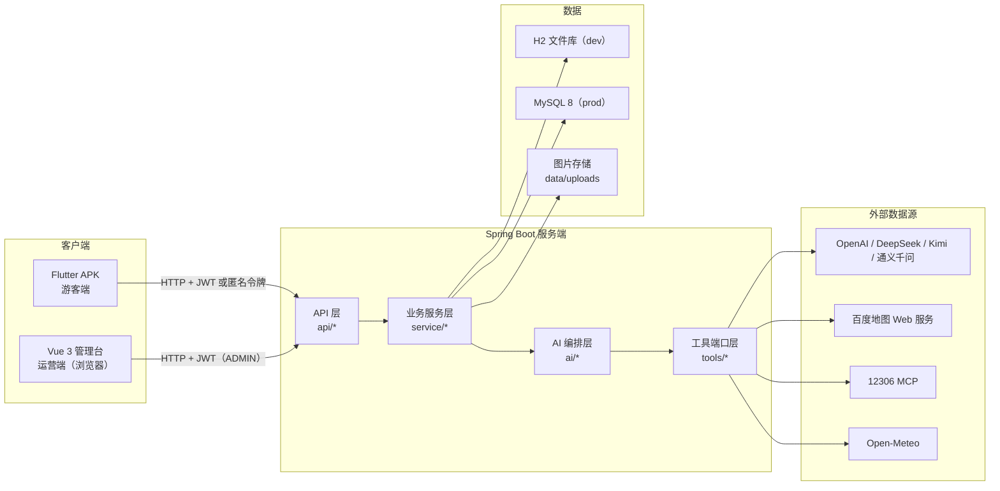
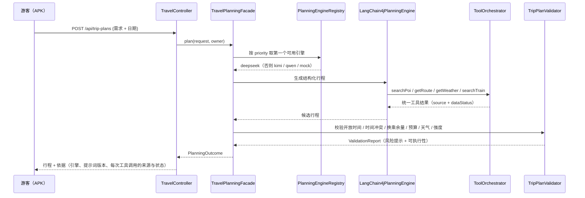
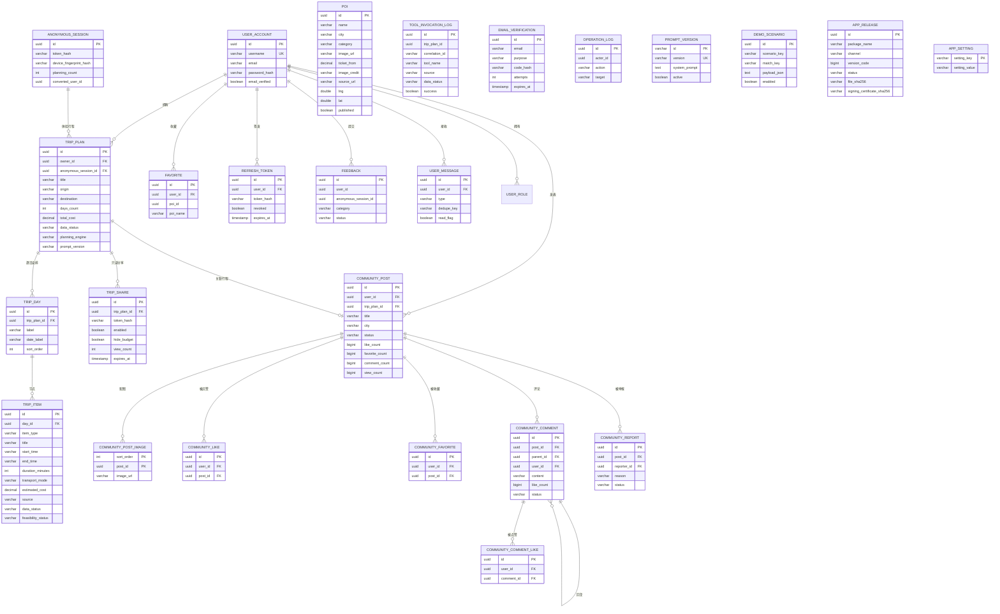

# 《豫见智旅》技术架构与数据模型

> 面向比赛"技术路线"评分项。本文只写**代码里真实存在**的东西：
> 每个模块、每个外部数据源、每张表都能在仓库里找到对应实现。
> 计划过但最终换掉的技术在第 6 节如实列出并给出替换理由。

## 1. 总体架构

系统由三条线组成：

| 线 | 形态 | 面向 | 代码位置 |
| --- | --- | --- | --- |
| 游客端 | Flutter Android APK | 游客 | `flutter_app/` |
| 服务端 | Spring Boot 3.3.5 / Java 17 | 全部 | `backend/server/` |
| 运营端 | Vue 3 + Vite 单页管理台 | 运营 / 管理员 | `backend/admin/` |

一条硬性边界：

> **APK 从不直连任何外部数据源。** 12306、百度地图、Open-Meteo、大模型全部由服务端编排，
> 第三方 AK / API Key 只存在于服务端环境变量，安装包里没有密钥。



## 2. 客户端：Flutter APK

### 2.1 导航结构

底部四个一级入口，避免移动端导航过载：

| Tab | 职责 |
| --- | --- |
| 发现 | 品牌横幅（运营台可换图与文案）、一句话输入、四个快捷入口（附近景点 / 景点推荐 / 行程规划 / 文化锦囊）、场景标签、精选路线、热门推荐、文化锦囊预览、消息与头像入口 |
| 旅记 | 社区信息流（城市/主题筛选、分页）→ 详情（图片宫格、点赞、收藏、二级评论）→ 发布与"我的旅记" |
| 行程 | 「我的行程」首页（进行中行程 / 新建 / 历史行程 / 足迹）→ 出行条件表单 → 生成 → 结果（行程 / 地图 / 预算 / 天气）→ 局部调整与撤销 |
| 我的 | 账号、我获得的互动数据、收藏总站（景区 / 旅记 / 行程）、我的旅记、消息通知、设置与退出 |

首页的自然语言输入与"规划"页共用同一份状态：首页写一句话点"开始规划"，会直接带着文本切到行程 Tab，
不是两个互不相干的输入框。

### 2.2 目录分层

| 目录 | 职责 |
| --- | --- |
| `lib/app/` | 启动引导：第一帧先画品牌加载页，再并行初始化平台服务；失败给出重试而不是白屏 |
| `lib/core/config/` | 构建期环境解析（`API_BASE_URL` 等），release 无明文回退 |
| `lib/core/network/` | Dio 工厂、会话拦截器、统一错误模型 `ApiFailure` |
| `lib/core/storage/` | 匿名/登录令牌走系统安全存储；内容走 JSON 文件缓存 |
| `lib/core/theme/` | 色彩、间距、字体 token（青黛 / 朱砂 / 麦穗金，圆角 18 / 14） |
| `lib/core/widgets/` | 跨页复用的表单控件、状态徽标、图片板、路线尺、城市弹层、统一图标、用户头像、元信息流等 |
| `lib/core/icons/` | 全应用图标登记处（点赞/收藏的选中与未选中两态），换图只改一处 |
| `lib/core/platform/` | 原生能力桥接（读取本机版本信息、打开下载） |
| `lib/data/repositories/` | 唯一的网络出入口，负责"远端 → 缓存 → 本地演示"三级降级 |
| `lib/models/` | 与后端 JSON 一一对应的模型 |
| `lib/screens/` | 页面与页面级状态 |

### 2.3 依赖（`flutter_app/pubspec.yaml`，全部 MIT / BSD）

| 依赖 | 版本 | 用途 |
| --- | --- | --- |
| flutter_riverpod | ^2.5.1 | 状态管理与依赖注入 |
| dio | ^5.7.0 | HTTP 客户端与拦截器 |
| flutter_secure_storage | ^9.2.2 | 令牌入系统 keystore |
| cached_network_image | ^3.4.1 | 景区图磁盘缓存，支撑弱网看图 |
| path_provider | ^2.1.5 | 缓存目录定位 |
| share_plus | ^10.1.2 | 系统分享 |
| geolocator | ^14.0.2 | 「附近的景点」定位（用户主动触发一次） |
| image_picker | ^1.2.3 | 发布旅记选图、上传自定义头像 |

刻意**没有**引入的依赖见第 6 节（GoRouter、Drift、timeline_tile、FL Chart、百度地图 Flutter 插件）。

## 3. 服务端：Spring Boot

### 3.1 分层

| 包 | 职责 |
| --- | --- |
| `api/` | 控制器、请求/响应模型、全局异常处理；只做参数校验与编排 |
| `service/` | 账号、匿名会话、行程、分享、收藏、反馈、媒体、统计、地理编码 |
| `ai/` | 规划引擎注册表、四家 LLM 适配、提示词工厂、结果解析、行程校验器 |
| `tools/` | 外部数据源统一端口：天气 / 路线 / 车次 / 门票 / 开放时间 |
| `map/` | 静态底图代理、票据、投影与可信度判定 |
| `domain/` | 24 个 JPA 实体（含社区、版本发布、运行时设置） |
| `security/` | JWT 过滤器、匿名会话过滤器、分桶限流与请求体积护栏 |
| `infrastructure/` | 外部服务 HTTP 客户端、APK 包校验器 |

### 3.2 AI 规划链路



三条设计原则：

1. **LLM 只负责"理解与生成"，不负责事实承诺。** 时间冲突、开放时间、距离、预算、强度全部由后端算；
2. **供应商可降级。** 四家（OpenAI priority 10 / DeepSeek 20 / Kimi 30 / 通义千问 40）按优先级尝试，
   全部失败落到本地 Mock 引擎，并在界面上标注"演示数据"；
3. **工具调用可追溯。** 每次调用都会落 `tool_invocation_log`，行程的"方案依据"页读的就是它。

### 3.3 工具端口

| 端口方法 | 数据源 | 无数据时 |
| --- | --- | --- |
| `searchPoi(keyword, city)` | 百度地图 Web 服务 / 内容库 | 内容库兜底 |
| `getRoute(origin, destination, mode)` | 百度地图 Web 服务 | 带 `errorCode` 降级 |
| `getWeather(city, date)` | Open-Meteo | 降级为演示数据 |
| `searchTrain(origin, destination, date)` | 12306 MCP | 退回"非实时"参考时刻表 |
| `checkOpening(destination)` | 运营台内容库 | 系统资料 |
| `quoteTicketPrices(pois, city)` | 内容库参考价 | 端口预留（`TICKET_PROVIDER`） |

所有端口返回同一套字段：`data / source / queriedAt / isRealtime / isCached / isMock / expiresAt / errorCode / errorMessage`。

## 4. 运营管理台：Vue 3

| 视图 | 能力 |
| --- | --- |
| OverviewView | 用户 / 行程 / 内容 / 工具调用 / 分享总量与近 7 天趋势 |
| PoisView | 景点增删改查、上下架、配图上传、坐标维护与按名称解析、图片来源与授权登记 |
| AppResourcesView | 应用素材与内容库：全局视觉槽（首页横幅等）、主题路线、文化锦囊文章的编辑与发布开关 |
| ContentOpsView | 内容运营：城市/主题聚合、坐标与配图覆盖率、图片版权待办 |
| AiRunsView | 工具健康度、LLM 四家供应商健康度与降级顺序、AI 运行记录 |
| PromptVersionsView | 提示词版本发布、启用与回滚 |
| MockDataView | 演示场景的覆盖编辑与兜底规则 |
| CommunityModerationView | 旅记审核（通过/驳回/下架）、举报处理、评论查看与隐藏 |
| AppReleasesView | APK 上传与签名校验、正式/调试双通道发布、停用与重新发布 |
| SecurityView | 接口限流与外部工具每日配额的在线调整，含今日用量 |
| FeedbackView | 用户反馈受理与处理备注 |
| LogsView | 管理员操作日志 |
| LoginView | 管理员登录 |

技术栈：Vue 3.5 + Vite + TypeScript + Pinia + Vue Router + Axios + ECharts。
样式是自研 CSS token，**没有**使用 Element Plus / Naive UI —— 管理台只需要表格与统计，
自研样式反而避免了明显的"模板感"。

## 5. 外部数据源的职责分层

这是本项目相对"把四个接口堆在前端"的核心差异：

| 数据源 | 数据特征 | 在系统里负责什么 |
| --- | --- | --- |
| 12306（MCP） | 实时，官方车次与余票 | **跨城交通**：坐哪趟、有没有票、多少钱、多久 |
| 百度地图 Web 服务 | 准实时（含路况） | **市内交通**：车站→景点、景点→景点怎么走、多远 |
| Open-Meteo | 实时 + 预报，免费无需密钥 | **可行性判断**：下雨吗、太热吗、适不适合爬山 |
| 运营台内容库 | 人工维护的系统资料 | **兜底与解释**：门票参考价、建议时长、是否需预约 |
| 四家 LLM | 生成式 | **理解与表达**：解析需求、生成方案、解释推荐理由 |

分工原则：**实时的归实时、兜底的归内容库、算数的归后端。**

## 6. 技术选型对照（计划 vs 落地）

| 计划 | 实际 | 理由 |
| --- | --- | --- |
| Flutter + Riverpod + Dio | 一致 | — |
| GoRouter | 改用 Navigator | 单栈导航，无深链接需求；依赖已从 pubspec 移除 |
| Drift | 改用 JSON 文件缓存 | 只缓存景区库与最近方案，一个目录删干净；不引入 ORM |
| timeline_tile | 自绘时间轴 | 避免 `IntrinsicHeight` 在长列表的性能问题 |
| FL Chart | 预算改用比例条 | 竖屏信息密度更合适；点击可看具体金额 |
| 百度地图 Android SDK / Flutter 插件 | 服务端代理静态底图 + 客户端自绘标记 | SDK 要求把 AK 打进 APK，与"AK 只留服务端"冲突；候选 Flutter 插件长期未更新且许可证不明 |
| Geolocator / 定位 | **已接入** | 只服务「附近的景点」：用户主动触发一次，坐标不缓存不落库；拒绝授权退回按城市浏览 |
| 运行时服务器地址 | **已移除** | 改为打包期 `--dart-define=API_BASE_URL` 固定。编译期常量优先级高于本地存储，保留可改入口会出现"改过又自己变回去" |
| 图片与头像上传 | 服务端重编码去 EXIF | 与景点配图共用同一条链路，客户端只送原始文件 |
| MyBatis-Plus | Spring Data JPA | 计划原文即"MyBatis-Plus 或 JPA" |
| Redis | 未引入 | 计划标注"可选"；限流与设置缓存走进程内存，见第 10 节的口径说明 |
| Element Plus / Naive UI | 自研 CSS token | 避免模板感 |
| 12306 参考时刻表 | 升级为 12306 MCP 实时车次 | 见 `docs/PHASE10_RAILWAY_AND_TICKETS.md` |
| 自研 MCP 客户端 | `RailwayMcpClient` 内实现协议握手 | 未引入通用 MCP SDK，协议简单且可控 |
| 数据库结构 | Hibernate `ddl-auto` → **Flyway 版本化迁移** | 见第 7.4 节：`ddl-auto` 曾把长文本列建成 `TINYTEXT` 导致写入失败 |

## 7. 数据模型

### 7.1 ER 图



`user_role`、`trip_plan_warning`、`community_post_image` 都是 `@ElementCollection` 侧表。
`community_comment.parent_id` 是自关联：为空表示顶层评论，非空表示回复（**只做两层**，
回复的回复由服务端收敛到同一条顶层评论）。

### 7.2 表清单（31 张）

按领域分组。结构由 Flyway 迁移脚本定义（见 7.4），实体类位于
`backend/server/src/main/java/com/yujian/travel/domain/`。

**账号与权限**

| 表 | 说明 |
| --- | --- |
| `user_account` | 账号，密码 BCrypt 哈希，角色默认 USER；含自定义头像 `avatar_url` 与预设头像 `avatar_key` |
| `user_role` | 角色侧表（USER / ADMIN），`@ElementCollection` |
| `refresh_token` | 刷新令牌，轮换 + 撤销，只存哈希 |
| `anonymous_session` | 免登录试用会话，只存令牌哈希与规划次数 |
| `email_verification` | 邮箱验证码，只存哈希，带尝试次数与有效期 |

**内容与行程**

| 表 | 说明 |
| --- | --- |
| `poi` | 景点内容库（含图片授权来源与 BD09 坐标） |
| `trip_plan` | 行程主表（含快照版本与上一版快照，用于撤销） |
| `trip_day` | 逐日安排 |
| `trip_item` | 行程节点 |
| `trip_plan_warning` | 行程级风险提示，`@ElementCollection` |
| `trip_share` | 只读分享（可设有效期、可隐藏预算） |
| `favorite` | 景区收藏 |

**内容库与运营素材**

| 表 | 说明 |
| --- | --- |
| `app_visual_resource` | 全局视觉资源槽，主键是槽位名（首页横幅 `HOME_HERO` 等）；图片地址、授权与来源由运营台维护 |
| `theme_route` | 主题路线（首页"精选路线"卡片）：封面、亮点标签、一键规划提示词与发布开关 |
| `culture_article` | 文化锦囊文章：标题 / 摘要 / 正文 / 分类 / 封面 / 来源与授权 |
| `poi_media` | 景区图集，一景多图且有序；与 `poi` 主图分开，逐张登记授权 |

> V6 同时给 `poi` 补了 `opening_hours` / `reservation_note` / `home_featured` /
> `featured_sort_order` 四列：开放时间、预约提示与首页精选位改由运营台维护，
> 客户端只认接口，不再依赖本地常量。

**社区旅记**

| 表 | 说明 |
| --- | --- |
| `community_post` | 旅记主体，含审核状态、点赞/收藏/评论计数、浏览量 |
| `community_post_image` | 旅记配图（有序，最多 9 张） |
| `community_like` | 旅记点赞，`(user_id, post_id)` 唯一 |
| `community_favorite` | 旅记收藏（星标），与点赞分开计数 |
| `community_comment` | 评论与回复：`parent_id` 为空是顶层评论，非空是回复；含 `like_count` |
| `community_comment_like` | 评论点赞，`(user_id, comment_id)` 唯一 |
| `community_report` | 举报记录与处理结果 |

**运营与运行**

| 表 | 说明 |
| --- | --- |
| `tool_invocation_log` | 工具调用留痕（"方案依据"页与配额统计的数据来源） |
| `operation_log` | 管理员操作日志 |
| `prompt_version` | 提示词版本，支持发布 / 启用 / 回滚 |
| `demo_scenario` | 演示场景覆盖项，未命中时回退内置样例 |
| `user_message` | 服务端消息中心；`dedupe_key` 保证同一事件只发一条 |
| `feedback` | 用户反馈 |
| `app_release` | APK 发布记录：双通道、签名指纹、文件哈希、更新策略 |
| `app_setting` | 运行时设置：接口限流额度与外部工具每日配额 |
| `flyway_schema_history` | Flyway 框架表，记录已应用的迁移版本 |

> `trip_plan.days` 使用 `CascadeType.ALL + orphanRemoval = true`，
> 删除主表会连带清掉逐日与节点，不会留下孤儿数据。

### 7.3 行程节点字段（`trip_item`）

```text
id                    UUID 主键
day_id                所属日期
item_type             attraction / meal / transport / rest / activity
title                 节点名称
description           推荐理由
start_time / end_time 起止时间（HH:mm）
duration_minutes      停留时长
transport_mode        交通方式
distance_meters       距离
estimated_cost        预计费用
source                数据来源（内容库 / 百度地图 / 12306 / Open-Meteo）
data_status           实时 / 缓存 / 系统资料 / 演示
feasibility_status    可执行性校验结果
risk_warnings         风险提示
alternative_title     替代节点
sort_order            同日内排序
```

### 7.4 数据库结构由 Flyway 版本化

早期用 Hibernate 的 `ddl-auto=update` 建表，代价是**结构变更没有记录、也无法复现**。
真实踩过一次：`@Lob` 字段被建成 `TINYTEXT`（上限 255 字节），长提示词一写入就失败，
只能在服务器上手工 `ALTER` 救回来。

现在改为 Flyway 管理，脚本位于 `backend/server/src/main/resources/db/migration/`：

| 脚本 | 内容 |
| --- | --- |
| `V1__baseline_schema.sql` | 完整结构快照。由 Hibernate 按 MySQL 方言生成后整理，**不是手抄**——UUID 是 `binary(16)` 而非 `char(36)`、布尔是 `bit`、时间戳是 `datetime(6)`，任何一列凭印象写错都会在运行期才暴露 |
| `V2__lob_columns_to_longtext.sql` | 四个 `@Lob` 列统一改为 `LONGTEXT` |
| `V3__comments_avatar_and_release_channel.sql` | 评论表、自定义头像列、APK 发布通道 |
| `V4__comment_replies_likes_and_message_dedupe.sql` | 二级评论、评论点赞、消息去重键 |
| `V5__app_settings.sql` | 运行时设置表 |
| `V6__app_resources_routes_culture_and_poi_media.sql` | 应用视觉资源槽、主题路线、文化锦囊、景区图集；并预置三条示范走廊，与原先硬编码内容一一对应 |

两个设计取舍：

1. **V1 每句都是 `CREATE TABLE IF NOT EXISTS`，索引与约束写在表内。** 同一份脚本要同时满足
   "空库完整建表"和"已有库完全空操作"；MySQL 没有 `CREATE INDEX IF NOT EXISTS`，拆出来会在已有库上直接报错。
2. **用 `baseline-on-migrate` 接管已有库。** 见到"非空但没有版本表"的库时打一条 v0 基线，
   再从 V1 开始跑，不删表、不清数据。

配置口径：开发（H2）关闭 Flyway、`ddl-auto=update`；生产（MySQL）开启 Flyway、`ddl-auto=none`
（可用 `SPRING_JPA_HIBERNATE_DDL_AUTO` 覆盖为 `validate`）。

## 8. 接口清单

### 8.1 游客端

| 方法 | 路径 | 说明 |
| --- | --- | --- |
| POST | `/api/auth/register` `/login` `/refresh` `/logout` | 账号 |
| GET | `/api/auth/me` | 当前会话 |
| POST | `/api/auth/merge-anonymous` | 登录后合并匿名行程 |
| POST / GET | `/api/anonymous/session` | 匿名试用会话 |
| GET | `/api/home` | 首页聚合：横幅文案与图片、精选路线、推荐景点、文化预览一次取齐 |
| GET | `/api/theme-routes` `/api/culture-articles` `/api/culture-articles/{id}` | 主题路线与文化锦囊（列表 / 详情） |
| GET | `/api/pois` `/api/pois/{id}` | 景区列表与详情（详情含图集、开放时间与预约提示） |
| POST | `/api/trip-plans/preview` | 需求解析预览（不落库） |
| POST / GET | `/api/trip-plans` | 生成与列表 |
| GET / PATCH / DELETE | `/api/trip-plans/{id}` | 详情 / 重命名 / 删除 |
| POST | `/api/trip-plans/{id}/adjust` `/undo` | 局部调整与撤销 |
| GET | `/api/trip-plans/{id}/today` | 今日行程与下一站 |
| GET | `/api/trip-plans/{id}/trace` | 方案依据 |
| GET | `/api/trip-plans/{id}/map` | 当日地图快照 |
| GET | `/api/map/image` `/api/map/size` | 服务端代理的静态底图 |
| POST / GET / DELETE | `/api/trip-plans/{id}/share`、`/api/trip-shares/{token}` | 只读分享 |
| GET | `/share/{token}` | 公开只读分享页（无需登录、无需装 App） |
| POST / GET / DELETE | `/api/favorites`、`/api/favorites/poi/{poiId}` | 收藏 |
| POST | `/api/feedback` | 反馈（匿名可提交） |
| POST | `/api/email/send-code` `/verify-code` | SMTP 预留接口 |

**账号资料与消息**

| 方法 | 路径 | 说明 |
| --- | --- | --- |
| PATCH | `/api/auth/me` | 修改昵称与预设头像（选预设会清空自定义头像） |
| POST / DELETE | `/api/auth/me/avatar` | 上传 / 移除自定义头像（multipart，去 EXIF） |
| POST | `/api/auth/change-password` `/logout-all` `/delete-account` | 账号安全 |
| GET | `/api/messages` `/unread-count` | 消息中心 |
| PATCH | `/api/messages/{id}/read` `/read-all` | 标记已读 |
| GET | `/api/pois/nearby` | 附近的景点（按直线距离，坐标不落库） |

**社区旅记**

| 方法 | 路径 | 说明 |
| --- | --- | --- |
| GET | `/api/community/posts` | 公开信息流（城市 / 主题筛选 + 分页） |
| GET | `/api/community/posts/{id}` | 旅记详情（浏览量 +1） |
| POST / PATCH / DELETE | `/api/community/posts` `/posts/{id}` | 发布 / 编辑 / 删除；编辑后重新进入审核 |
| GET | `/api/community/posts/mine` `/posts/favorites` | 我的旅记 / 我收藏的旅记 |
| POST / DELETE | `/api/community/posts/{id}/like` `/favorite` | 点赞 / 收藏（各自独立计数） |
| POST | `/api/community/posts/{id}/report` | 举报 |
| GET / POST | `/api/community/posts/{id}/comments` | 评论列表（顶层评论带全部回复）/ 发表评论或回复（传 `parentId`） |
| DELETE | `/api/community/comments/{id}` | 撤回自己的评论 |
| POST / DELETE | `/api/community/comments/{id}/like` | 评论点赞 |
| GET | `/api/community/stats/me` | 我获得的互动数据（帖子获赞 / 评论获赞 / 被收藏 / 我的评论） |
| POST | `/api/community/media/images` | 旅记配图上传（multipart） |

**版本更新**

| 方法 | 路径 | 说明 |
| --- | --- | --- |
| GET | `/api/app-releases/check` | 版本检查（带包名、versionCode、channel） |
| GET | `/api/app-releases/{id}/download` | 下载安装包 |
| POST | `/api/app-releases/ack` | 更新回执，触发消息中心的版本通知（带去重键） |

### 8.2 运营管理台（需 ADMIN）

| 方法 | 路径 |
| --- | --- |
| GET / POST / PUT / DELETE | `/api/admin/pois`、`/api/admin/pois/{id}` |
| PATCH | `/api/admin/pois/{id}/publish` |
| POST | `/api/admin/pois/geocode`（只回参考坐标，不落库） |
| GET / POST / PUT / DELETE | `/api/admin/pois/{id}/media`、`/api/admin/pois/{id}/media/{mediaId}`（景区图集） |
| GET / POST / PUT / DELETE | `/api/admin/theme-routes`、`/api/admin/theme-routes/{id}` |
| GET / POST / PUT / DELETE | `/api/admin/culture-articles`、`/api/admin/culture-articles/{id}` |
| GET / PUT | `/api/admin/app-resources`、`/api/admin/app-resources/{slot}` |
| POST | `/api/admin/media/images`（multipart） |
| GET | `/media/{fileName}` |
| GET | `/api/admin/stats/overview` |
| GET | `/api/admin/tools/health` |
| GET | `/api/admin/llm/providers` |
| GET / PATCH | `/api/admin/feedback`、`/api/admin/feedback/{id}` |
| GET | `/api/admin/logs` |

**社区审核**

| 方法 | 路径 | 说明 |
| --- | --- | --- |
| GET | `/api/admin/community/posts` | 审核队列（待审核 / 已通过 / 已驳回 / 已下架） |
| PATCH | `/api/admin/community/posts/{id}/status` | 通过 / 驳回 / 下架 / 退回待审 |
| GET | `/api/admin/community/reports` | 举报列表 |
| PATCH | `/api/admin/community/reports/{id}` | 处理举报 |
| GET | `/api/admin/community/posts/{id}/comments` | 一篇旅记的全部评论（含已隐藏） |
| PATCH | `/api/admin/community/comments/{id}` | 隐藏 / 恢复评论（不删行） |

**版本发布**

| 方法 | 路径 | 说明 |
| --- | --- | --- |
| GET | `/api/admin/app-releases` | 发布记录列表 |
| POST | `/api/admin/app-releases?channel=` | 上传 APK（`RELEASE` 校验证书白名单；`DEBUG` 只校验签名有效性） |
| POST | `/api/admin/app-releases/{id}/publish` | 配置更新说明、最低支持版本与更新策略后发布 |
| PATCH | `/api/admin/app-releases/{id}/disable` `/{id}/restore` | 停用 / 重新发布（只能往上恢复，不允许回退到旧版本） |

**提示词、Mock 与限流**

| 方法 | 路径 | 说明 |
| --- | --- | --- |
| GET / POST | `/api/admin/llm/prompts`、`/{id}/activate` | 提示词版本发布与回滚 |
| GET | `/api/admin/mock/scenarios`、PUT `/scenarios/{key}/{matchKey}` | 演示场景覆盖 |
| GET / PUT | `/api/admin/security/limits` | 限流与工具配额读写 |
| PATCH | `/api/admin/security/limits/reset` | 恢复默认值 |

## 9. 缓存、降级与数据状态口径

三级降级：**远端 → 离线缓存 → 本地演示数据**。每一级都会带状态标签，界面上不允许含糊。

| 状态 | 含义 |
| --- | --- |
| 实时 | 本次请求真的拿到了外部数据 |
| 缓存 | 命中服务端或客户端缓存，附更新时间 |
| 系统资料 | 运营台人工维护的内容（门票参考价、建议时长等） |
| 演示 | 外部源不可用时的降级结果，或 `APP_TOOLS_MODE=mock` |
| 演示（降级） | 外部源调用失败后由兜底数据顶上，具体原因记在工具轨迹里 |
| AI 生成 | 由大语言模型产出、未经外部核验的内容（行程正文与推荐理由） |
| 已过期 | 缓存超出有效期，仍可展示但明确标注 |

服务端侧另有：天气 30 分钟、车次 30 分钟、底图 12 小时的缓存窗口。

这套标识的意义是**不让降级结果冒充实时数据**：模型生成的内容标 `AI 生成`，
取不到的外部数据标 `演示（降级）`，两者都不允许展示为"实时数据"。

## 10. 安全与密钥边界

| 项 | 做法 |
| --- | --- |
| 密码 | BCrypt 哈希，绝不明文 |
| 令牌 | 短期访问令牌 + 轮换刷新令牌，只存哈希 |
| 权限 | 行程按归属校验，防水平越权；管理台接口要求 ADMIN |
| 密钥 | 百度 AK / LLM Key / SMTP 只读环境变量；APK 内无密钥 |
| 日志 | 不记录令牌、密码与完整敏感请求 |
| 匿名 | 只存令牌哈希、设备指纹哈希与规划次数，不存精确位置历史 |
| 分享 | 可设有效期、可隐藏预算、可随时关闭，内容不含账号信息 |
| 采集边界 | 不采集身份证号、银行卡号、支付信息 |
| 数据库结构 | Flyway 版本化迁移，生产环境 `ddl-auto=none`（见 7.4） |
| 接口限流 | 六个桶：登录 10 次/分、生成行程 20 次/分 + 60 次/日、上传 30 次/分、写操作 60 次/分、读接口 300 次/分。超额返回 429 并带 `Retry-After` |
| 限流主体 | 登录用户按账号计，匿名按 IP 计；`X-Forwarded-For` 仅在直连方为内网时采信（否则任何人伪造该头即可绕过限流） |
| 工具配额 | 天气 / 路线 / 铁路三组每日上限，运营台可调。额度用尽时**熔断并如实标注未取到实时数据**，不继续消耗上游额度 |
| 请求体积 | 非上传请求超过 1 MB 返回 413（JSON body 不受容器表单上限约束） |
| 内容安全 | 社区旅记先审后发，人工审核通过才公开；提供举报入口，管理员可下架并通知作者 |
