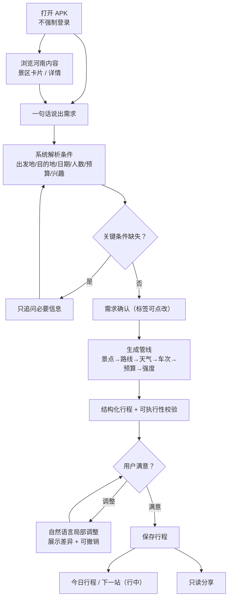

# 《豫见智旅》系统说明书

> 面向比赛"系统说明"评分项。读完这一份应当能：知道给谁用、怎么跑起来、
> 每个页面能做什么、数据从哪来、隐私边界在哪。

## 1. 作品定位

**豫见智旅** —— 面向河南自由行游客的 AI 旅行规划与智慧出行平台。

它不是旅游资讯浏览器，也不是"生成一段文案"的聊天机器人，而是把

> "想去河南旅行" → **一份有依据、能调整、可执行、可分享的移动方案**

交付形态：

| 部分 | 形态 | 面向 |
| --- | --- | --- |
| 主产品 | Flutter Android APK | 游客 |
| 服务端 | Spring Boot REST API | 支撑全部 |
| 管理台 | Vue 3 浏览器页面 | 运营人员 |

## 2. 目标用户与场景

### 2.1 核心用户

> 计划在河南省内进行 **一至三日自由行** 的游客。

- 第一次来河南的外地游客；
- 河南本地周末短途游客；
- 对历史文化、自然山水、特色美食感兴趣的游客；
- 不熟悉河南景区分布与交通衔接、不想翻大量攻略的人。

### 2.2 首版内容范围

不做"全省全景点覆盖"，而是先把三条示范走廊做透：

| 走廊 | 主题 | 代表内容 |
| --- | --- | --- |
| 郑州 — 开封 | 古都文化、城市漫游、夜游美食 | 清明上河园、开封府、大相国寺、包公祠 |
| 郑州 — 洛阳 | 历史文化、石窟、博物馆 | 龙门石窟、洛阳博物馆、白马寺、隋唐洛阳城、少林寺及嵩山 |
| 焦作 — 云台山 | 山水自然、周末短途、天气敏感 | 云台山、红石峡、潭瀑峡、茱萸峰 |

每条走廊都具备：配图、文化介绍、开放时间、门票参考、建议时长、交通与路线、
天气影响、预算估算、替代方案、可直接演示的 AI 路线。

## 3. 运行环境与部署

### 3.1 环境要求

| 组件 | 版本 |
| --- | --- |
| JDK | 17 |
| Flutter | 3.x（本机 3.47.5 / Dart 3.13.4） |
| Node.js | 18+ |
| Android | 10 及以上，调试可用模拟器 |
| 数据库 | 开发默认 H2 文件库（免安装）；交付/演示用 `prod` profile 连 MySQL 8（见 3.5） |

### 3.2 三条线怎么起

```bat
:: 1) 后端（自动读取 scripts\local.env 里的密钥，密钥不进仓库）
scripts\run-server-dev.cmd

::    想直接连 MySQL 8 就跑这一条（先按 3.5 初始化一次库）
:: scripts\run-server-mysql.cmd

:: 2) 运营管理台
cd admin
npm install
npm run dev
:: 浏览器打开 http://localhost:5173

:: 3) 游客端 APK
cd flutter_app
flutter build apk --debug
:: 产物 flutter_app\build\app\outputs\flutter-apk\app-debug.apk
```

### 3.3 装到模拟器 / 真机上怎么连后端

| 产物 | 能否连本地后端 | 用途 |
| --- | --- | --- |
| `app-debug.apk` | **能**：内置 `http://10.0.2.2:8080/api`（模拟器访问宿主机），debug 允许明文流量 | 模拟器联调、看真实数据 |
| `app-release.apk` | 不能，必须 `--dart-define=API_BASE_URL=https://...` 指向 HTTPS 后端 | 交付 / 离线演示 |

**所以：调试包要看到真实数据，本机的 Spring 服务必须开着**（管理台的 npm 只在你要看后台时开）。
release 包刻意不带明文回退：一个会偷偷连 `http://localhost` 的发布包进不了应用市场，
也和"数据安全与合规"评分直接冲突。

### 3.4 一键把 APK 装进模拟器

```bat
adb install -r flutter_app\build\app\outputs\flutter-apk\app-debug.apk
```

（本机 `tooling\android-sdk\platform-tools\adb.exe` 已随工具链加入 PATH。）

### 3.5 数据库：开发用 H2，交付用 MySQL 8

APK **不直接连数据库**，它只通过 HTTP 访问后端；真正决定"数据存哪"的是后端的 Spring profile。

| profile | 存储 | 位置 | 什么时候用 |
| --- | --- | --- | --- |
| `dev`（默认） | H2 文件库 | `server\data\yujian.mv.db` | 本机开发、随手跑通，不需要额外装数据库 |
| `prod` | MySQL 8 | `application-prod.yml` 的 `MYSQL_URL` | 交付、演示、需要真正用上关系型数据库 |

两条命令就能切到 MySQL 8：

```bat
:: 方式 A：用本机已安装的 MySQL 8（默认 3306），只需 root 口令跑一次初始化
scripts\init-mysql.cmd
scripts\run-server-mysql.cmd

:: 方式 B：用 docker compose 里的 MySQL 8（本机统一用它，映射 3306）
docker compose up -d mysql
scripts\run-server-mysql.cmd
```

> 两条路径的**数据互不相通**：`dev` 的 H2 文件里已有的账号与行程**不会**自动迁到 MySQL。
> 切到 MySQL 后要么重新注册，要么靠启动脚本里的 `ADMIN_USERNAME` / `ADMIN_PASSWORD`
> 重新引导运营账号。H2 定位始终是"开发/应急"，正式交付用 MySQL。

## 4. 信息架构

底部三个一级入口：

```text
发现   品牌首屏 + 一句话输入 + 快捷场景 + 三条走廊 + 景区卡片
行程   条件表单 → 生成 → 结果（行程 / 地图 / 预算 / 天气）→ 调整 → 历史行程
我的   登录注册 + 收藏 + 分享 + 反馈 + 关于与隐私
```

地图、预算、天气、收藏不被提为一级导航 —— 移动端一级入口超过四个会明显增加认知负担。

## 5. 核心业务流程



> 首次体验不需要登录；只有**保存、收藏、同步、分享**时才引导登录。
> 未登录也能完整走完一次规划 —— 这是产品设计里明确保留的"先体验后注册"路径。

## 6. 页面与状态清单

### 6.1 发现页

| 元素 | 说明 |
| --- | --- |
| 顶部 | 品牌标识、消息入口、用户入口 |
| 主视觉 | 河南山河 / 古建筑影像 + "一句话，规划你的河南之旅" |
| 输入区 | 自然语言输入框 + "开始规划" / "帮我安排行程" |
| 快捷场景 | 周末短途 / 古都寻迹 / 山水秘境 / 河南美食（一点即带入完整句子） |
| 内容区 | 三条示范走廊 + 景区大图卡片（城市标签、一句话介绍、门票、时长、是否适合雨天） |
| 决策支持 | 数据状态图例（实时 / 缓存 / 系统资料 / 演示 / 已过期） |

首页不做成"只有一个表单"：输入框是入口，内容本身才是留人理由。

### 6.2 景区卡片与详情

卡片回答四个问题：**值不值得去、适合谁、要多久、能不能放进当前行程。**

详情页包含：头图、文化介绍、开放时间、门票参考、建议时长、适合人群、体力要求、
最佳季节、天气适宜度、周边景点、推荐交通、数据来源与更新时间、图片来源与授权。
底部固定主操作是"加入我的行程"。

### 6.3 行程页（生成前）

出行条件表单：

| 字段 | 交互 |
| --- | --- |
| 出发地 / 目的地 | 左右布局，中间环形箭头一键对调（带动画）；点击任一侧弹城市选择层，可搜索可手输 |
| 出行日期 | 全中文日历弹层 + 快捷入口（今天 / 明天 / 本周末） |
| 行程天数 | 可输入的步进控件，超出范围当场夹回 |
| 同行人数 | 成人 / 儿童排在同一行 |
| 预算 | 人均预算输入 |
| 兴趣偏好 | 多选 + **自定义输入**，添加后不破坏布局 |
| 体力偏好 | 多选 + **自定义输入** |
| 交通方式 | 展开态候选与收起态回填联动 |

另有"历史行程"入口：列出全部行程，点开续看，行尾可重命名或删除（删除需二次确认）。

### 6.4 行程结果页

四个 Tab：**行程 / 地图 / 预算 / 天气**。

- **行程**：纵向时间轴，每个节点给出时间、停留时长、交通方式、距离、费用、来源与状态、
  可执行性校验、风险提示与替代节点；顶部是"为什么这个方案走得通"的四项核对。
- **地图**：底图由服务端代取（AK 不下发），标记与折线由客户端自绘，与时间轴联动；
  底图不可用时退回文字路线，不白屏。
- **预算**：总额、人均、交通 / 门票 / 餐饮 / 住宿 / 其他拆分，以及与预算上限的差值。
- **天气**：温度、降水概率、风力、户外适宜度、建议携带物品、雨天替代方案。

### 6.5 调整与撤销

支持自然语言调整："第二天轻松一点""把博物馆换成龙门石窟""预算控制在 800 以内"
"下雨时提供室内替代方案""只调整今天下午的安排"。

每次调整都会展示：改了哪些节点、总耗时变化、总预算变化、强度变化、新增风险，
并提供 **撤销本次调整**。

### 6.6 我的

登录 / 注册、收藏列表、我的行程、我的分享、意见反馈、关于与隐私政策。

### 6.7 空、加载、错误、缓存状态

| 状态 | 表现 |
| --- | --- |
| 加载 | 骨架 / 明确的进度文案，不用动画掩盖网络等待 |
| 空 | 说明为什么空 + 下一步可做什么（例："还没有行程，去规划一次"） |
| 错误 | 就近提示 + 可重试 + 保留用户已输入内容，附错误编号 |
| 缓存 | 正常展示并标注"缓存 / 已过期 + 更新时间" |
| 降级 | 明确写"演示数据"，绝不说成实时 |

## 7. 数据来源与"数据状态"口径

| 数据 | 来源 | 状态标签 |
| --- | --- | --- |
| 景点、开放时间、门票参考 | 运营台内容库 | 系统资料 |
| 市内路线、POI | 百度地图 Web 服务 | 实时 |
| 天气 | Open-Meteo | 实时（30 分钟缓存） |
| 跨城车次与余票 | 12306 MCP | 实时（30 分钟缓存） |
| 行程、预算、强度 | 服务端计算 | AI 生成 / 系统计算 |
| 外部源不可用 | 降级 | 演示（带 `errorCode` 与原因） |

硬约束：**不把演示数据说成实时**。依据页、行程提示、运营统计三处保持同一口径。

## 8. 数据安全与隐私保护

### 8.1 采集边界

首版**不采集**：身份证号、银行卡号、支付信息、与旅行无关的精确住址、后台持续定位轨迹。

### 8.2 客户端

- 令牌存系统安全存储（Keystore），不写明文文件；
- 密码与第三方密钥绝不落客户端；
- 缓存只保留景区内容、最近行程与收藏；
- 卸载或清数据即彻底清除本地内容。

### 8.3 服务端

- 密码 BCrypt 哈希；刷新令牌只存哈希并支持轮换与撤销；
- 行程按归属校验（含匿名会话归属），防水平越权；
- 管理接口要求 ADMIN 角色；
- 密钥只从环境变量读取，日志不记录令牌与密码。

### 8.4 匿名试用

| 记录 | 用途 |
| --- | --- |
| `anonymousSessionId` | 标识这一次试用 |
| `deviceFingerprintHash` | 只用于限流，单向哈希 |
| `planningCount` | 试用额度计数 |
| `expiresAt` | 自动失效 |

不保存精确位置历史，不把设备标识用于无关追踪。用户登录后可以把这次方案合并进账号。

## 9. 合规说明

| 项 | 做法 |
| --- | --- |
| 第三方图片 | 内容库登记 `image_credit` 与 `source_url`，详情页对用户可见；当前库内是占位示例图并已如实标注 |
| 12306 | 只做查询展示，不抓取网页、不保存证件、不代购，购票引导至官方渠道 |
| 地图 | AK 只留服务端，客户端拿到的是底图位图与自绘标记 |
| 大模型 | 只发送规划所需的旅行条件，不发送账号凭据与个人敏感信息 |
| 分享 | 可设有效期、可隐藏预算、可随时关闭；接收者只读 |
| 用户权利 | 可删除行程、取消收藏、关闭分享、删除账号、查看隐私政策与第三方来源说明 |
| 开源许可 | 依赖全部为 MIT / BSD / Apache-2.0，逐项登记在 `THIRD_PARTY_NOTICES.md` |

## 10. 运营管理台

浏览器访问，需要 ADMIN 账号。六个视图：

| 视图 | 用途 |
| --- | --- |
| 总览 | 用户 / 行程 / 内容 / 工具调用 / 分享总量与近 7 天趋势 |
| 景点管理 | 增删改查、上下架、**配图上传**、坐标维护与按名称解析、图片来源与授权登记 |
| AI 运行 | 工具健康度、LLM 四家供应商健康度与降级顺序、AI 运行记录 |
| 反馈 | 用户反馈受理与处理备注 |
| 日志 | 管理员操作日志 |
| 登录 | 管理员登录 |

> 景区配图不必改代码：直接在"景点管理"里上传，客户端会实时取到。
> 上传的图片由服务端校验类型、大小与像素尺寸，并以公开只读地址 `/media/{fileName}` 提供。
